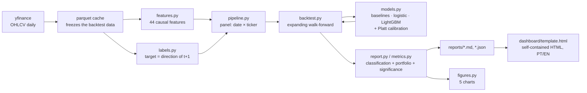
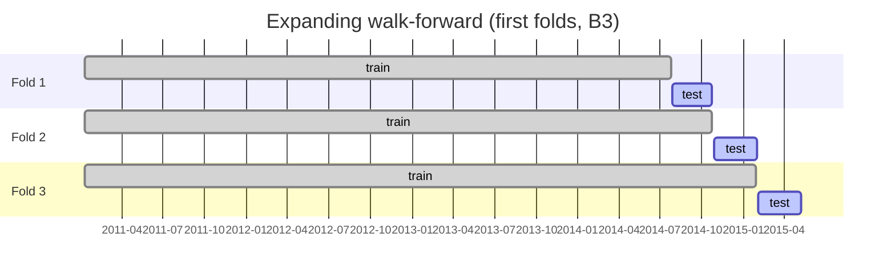
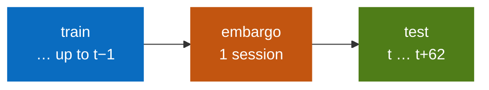
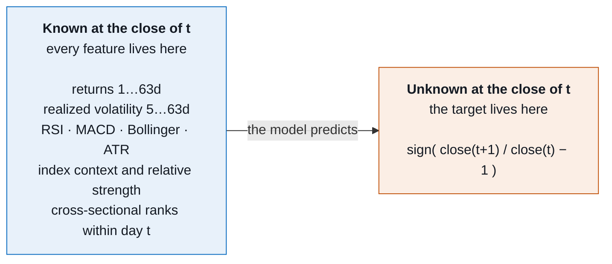
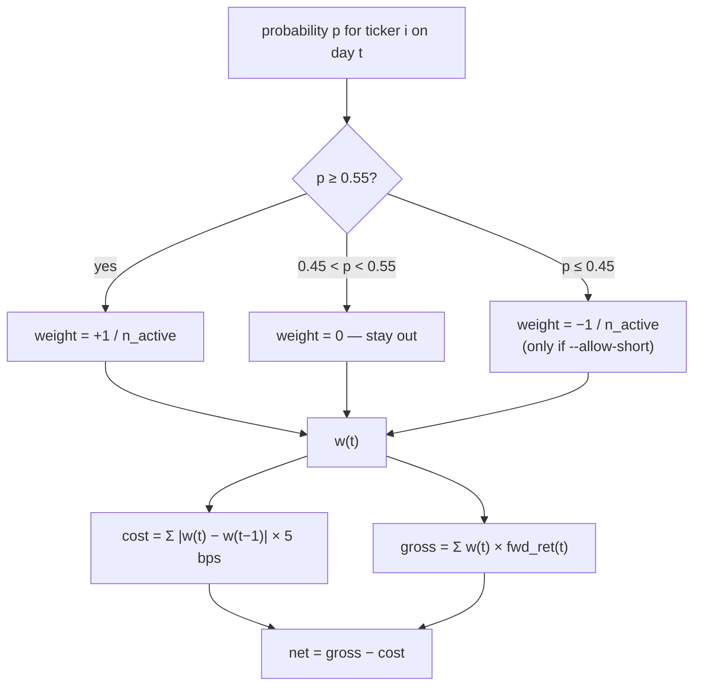

# market-direction

**English** · [Português](README.pt-BR.md)

[](https://github.com/madeiragab/market-direction/actions/workflows/ci.yml)

Next-day directional prediction for Brazilian (B3) and US (S&P 500) equities,
built around the question most projects of this kind never ask: **is the model
actually predicting anything, or is the backtest lying?**

The deliverable is not a pretty accuracy number. It is the measurement
infrastructure that lets you decide whether to believe the accuracy at all.

> **The honest headline:** on B3 there is a real, tiny edge — 50.60% accuracy
> against a coin's 50%, p = 0.0079 over 40,169 out-of-sample predictions. In the
> US there is no directional edge at all: 52.55% accuracy collapses to 49.94%
> balanced accuracy once you account for the market's upward drift. **Neither
> market produced a strategy that beat buy and hold.**

📊 **[Interactive dashboard](https://madeiragab.github.io/market-direction/)** — candles per ticker, model calls day by day, PT/EN.

---

## Results, no makeup

Everything below is **out of sample**, with walk-forward validation, transaction
cost and an embargo between train and test.

### B3 — 40,169 predictions, 2014-07 to 2026-08, 45 folds

| model | accuracy | balanced | AUC | p vs coin | net Sharpe | exposure |
|---|---|---|---|---|---|---|
| always up | 49.80% | 50.00% | 0.500 | 0.7877 | +0.74 | 100% |
| yesterday's sign | 49.04% | 49.03% | 0.490 | 0.9999 | −0.03 | 97% |
| random | 50.41% | 50.41% | 0.505 | 0.0498 | +0.15 | 100% |
| **logistic** | **50.60%** | **50.59%** | **0.510** | **0.0079** | +0.10 | 5% |
| LightGBM | 50.39% | 50.36% | 0.504 | 0.0598 | −0.15 | 6% |
| *buy and hold* | — | — | — | — | **+0.75** | 100% |

### S&P 500 — 47,805 predictions, 2013-12 to 2026-08, 51 folds

| model | accuracy | balanced | AUC | p vs coin | net Sharpe | exposure |
|---|---|---|---|---|---|---|
| always up | 52.77% | 50.00% | 0.500 | 0.0000 | +1.26 | 100% |
| yesterday's sign | 49.29% | 49.14% | 0.491 | 0.9990 | +0.21 | 97% |
| random | 50.24% | 50.25% | 0.502 | 0.1528 | +0.33 | 100% |
| **logistic** | 52.55% | **49.94%** | 0.503 | 0.0000 | +0.33 | 21% |
| LightGBM | 52.63% | 50.07% | 0.494 | 0.0000 | −0.03 | 18% |
| *buy and hold* | — | — | — | — | **+1.26** | 100% |

### How to read this

**B3 has a real but minuscule signal.** Logistic regression is right 50.60% of
the time against the coin's 50%, with p = 0.0079 over 40,000 predictions. It is
statistically detectable and economically irrelevant: a 0.6 percentage-point
edge does not pay for spread, turnover and taxes.

**The US has no directional signal at all.** The 52.6% accuracy is impressive
until you notice that 52.77% of days were up. Balanced accuracy — 49.94% — is the
honest number: the model learned that markets drift up, and nothing else.

**Three of the five p-values are misleading, on purpose.** `always_up` scores
p = 0.0000 in the US purely because it rides the drift, and `random` scores
p = 0.0498 in Brazil because with five models tested, one landing under 0.05 by
chance is exactly what you should expect. Those rows are in the table so the
reader sees how easy it is to manufacture a "significant" result.

**No strategy beat buy and hold.** In either market. That is the result, and it
is what anyone who has measured this properly would expect.

If you have seen a similar project reporting 85% accuracy, it almost certainly
has one of the three defects below — and this repository exists, in large part,
as the counter-example.

---

## The pipeline



---

## The three traps, and the defense against each

### 1. Random split on a time series

Shuffling dates lets the model train on Monday and Wednesday to predict Tuesday.
Accuracy explodes and means nothing.

**Defense:** expanding walk-forward in
[`backtest.py`](src/marketdir/backtest.py). Train on everything up to the cutoff,
test on the next 63-session block, move forward. 45 folds on B3, 51 on the US.
No evaluated prediction was ever seen by the model that produced it.



Between train and test sits a **1-day embargo**, because the target of row `t`
resolves at `t+1` and would otherwise touch the first day of the test block:



### 2. Future leakage in the features

One misplaced `shift`, one rolling window computed the wrong way, one `fillna`
that back-propagates — and the model sees tomorrow.

The rule the codebase enforces:



**Defense:** [`scripts/check_leakage.py`](scripts/check_leakage.py), which does
not argue — it tests:

```bash
python scripts/check_leakage.py --market BR
```

- **Truncation** — recomputes every feature using only history up to a date D and
  compares against the same features computed over the full history on that day.
  Measured difference: `0.000e+00`. If any window looked forward, it would show
  up here.
- **Target alignment** — verifies by hand that `fwd_ret[t]` is the return between
  `t` and `t+1`.
- **Shuffled target** — trains with labels permuted within each day. If accuracy
  climbs above the majority class, leakage came in through another path.

The caveat no test covers, stated out loud: prices come dividend- and
split-adjusted (`auto_adjust`), and today's adjustment rewrites prices from years
ago. That is a trace of future information that only disappears with
point-in-time unadjusted data.

### 3. Backtest without cost

High-turnover strategies die in the spread. Reporting gross returns is like
reporting salary before tax.

**Defense:** cost is charged on the **change** in weight, not on the weight —
holding a position open does not pay commission again. Default 5 bps per side.
The report carries a dedicated gross-vs-net Sharpe table.



---

## Beyond that: the probability has to be worth what it says

A system that says "62% chance of an up day" and is right 52% of the time is
lying with decimal places. So the project calibrates — and picks the calibrator
by measurement:

```bash
python scripts/compare_calibration.py --market BR
```

| method | Brier | log loss | p max | p min | ECE |
|---|---|---|---|---|---|
| raw | 0.25065 | 0.69454 | 0.913 | 0.047 | 0.02551 |
| **Platt** | **0.25018** | **0.69352** | 0.640 | 0.314 | **0.01271** |
| isotonic | 0.25101 | 0.69826 | **0.999** | 0.001 | 0.01833 |

Isotonic regression emits "99.9% chance of an up day" backed by a handful of
observations in the tail — far too flexible for a signal this weak. Platt's
two-parameter sigmoid cannot lie that way, and it wins on both Brier and ECE. It
is the default.

The calibrator is fitted on the **final slice** of the training window, never on
a random sample, and the cut is by date — the panel holds 15 tickers per day and
splitting mid-session would leave the same day on both sides.

---

## Architecture

```
src/marketdir/
  config.py     universes, period, backtest and cost parameters
  data.py       yfinance ingestion with parquet cache (freezes backtest data)
  features.py   44 features, causal by construction
  labels.py     D+1 target, close-to-close or open-to-close
  models.py     baselines + logistic + LightGBM + calibrator
  backtest.py   walk-forward and portfolio simulation with cost
  metrics.py    classification, strategy, binomial test, block bootstrap
  report.py     evaluation and report generation
  figures.py    5 figures, each answering one question
scripts/
  fetch_data.py           download and cache the histories
  check_leakage.py        leakage audit
  run_backtest.py         full walk-forward + report + figures
  compare_calibration.py  picks the calibrator by Brier/ECE
  predict_today.py        prediction for the next session
  export_history.py       recent candles + the model's call each day
  build_dashboard.py      builds the self-contained HTML dashboard
```

Deeper documentation:

| Document | English | Português |
|---|---|---|
| Architecture and data contracts | [docs/en/architecture.md](docs/en/architecture.md) | [docs/pt-BR/architecture.md](docs/pt-BR/architecture.md) |
| Methodology and statistics | [docs/en/methodology.md](docs/en/methodology.md) | [docs/pt-BR/methodology.md](docs/pt-BR/methodology.md) |

### Features (44)

Lagged returns (1 to 63 days), realized volatility (5 to 63), volatility-
normalized momentum, 12-1 momentum, distance from moving averages (20, 50, 200),
RSI, MACD, Bollinger %B, ATR, range, opening gap, close location inside the bar,
volume ratio, 252-day drawdown, skew, index context (Ibovespa or S&P 500),
relative strength against the index, cross-sectional ranks within the day, and
calendar effects.

Two choices that matter:

- **Pooled panel, not one model per ticker.** 15 tickers × 15 years gives the
  model enough data to learn market-wide patterns instead of memorizing one
  company's history.
- **Cross-sectional ranks.** Makes tickers trading at very different scales
  comparable within the same day, without the model having to relearn each
  scale.

### LightGBM hyperparameters

Deliberately conservative: `num_leaves=15`, `min_child_samples=200`,
`reg_lambda=10`, `learning_rate=0.02`. Financial data has a low signal-to-noise
ratio; a deep tree memorizes noise and the backtest looks great right up until it
doesn't. Even so, **logistic regression beats boosting in both markets** — a known
result in directional prediction, reproduced here.

---

## Running it

```bash
python -m venv .venv
.venv/Scripts/activate          # Linux/macOS: source .venv/bin/activate
pip install -r requirements.txt
```

```bash
python scripts/fetch_data.py --markets BR US
python scripts/check_leakage.py --market BR
python scripts/run_backtest.py --market BR
python scripts/run_backtest.py --market US
python scripts/predict_today.py
python scripts/export_history.py
python scripts/build_dashboard.py
```

A full backtest for one market takes about 45 seconds.

Useful `run_backtest.py` flags:

| flag | default | effect |
|---|---|---|
| `--threshold` | 0.55 | minimum probability to open a position |
| `--cost-bps` | 5.0 | cost per side, in basis points |
| `--target-mode` | close_to_close | or `open_to_close`, fully executable |
| `--test-block-days` | 63 | test block size (≈ 1 quarter) |
| `--allow-short` | off | allow short positions |

---

## Known limitations

- **Retroactively adjusted prices** (`auto_adjust`) carry a residue of future
  information. It disappears only with point-in-time unadjusted data, which
  yfinance does not provide.
- **No survivorship handling**: the universe is fixed and composed of tickers
  that exist today. Companies that went under along the way are not in the test,
  which pushes returns up — buy and hold's returns included.
- **Cost is an estimate**: 5 bps per side is reasonable for a liquid name,
  optimistic for a thin one. No market impact is modelled.
- **No taxes**: 15% on swing-trade gains in Brazil, 20% on day trades. Neither is
  in the calculation.
- **`close_to_close` assumes execution in the closing auction.** Use
  `--target-mode open_to_close` for the version without that assumption, at the
  cost of discarding the overnight return.

## Natural next steps

- **Top-N selection instead of a fixed threshold.** The raw probability ranks
  better than the calibrated one; buying the N best-ranked tickers of the day
  uses a weak signal better than an absolute cutoff.
- **Predict magnitude, not just direction.** Direction throws away the
  information that a 3% move and a 0.1% move are not worth the same.
- **A 5-day horizon.** Less noise per prediction and less turnover to pay for.
- **Volatility regime as a filter** rather than a feature: the signal may exist
  only in some regimes and be diluted by the average.

---

## Disclaimer

Study and portfolio project. The numbers above describe a system that **does not
beat buy and hold**. Nothing here is investment advice.
