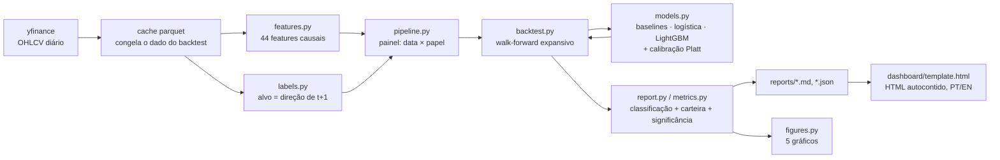
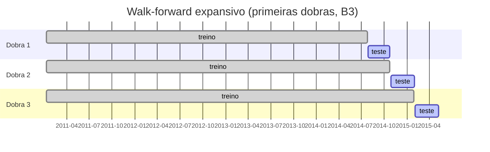
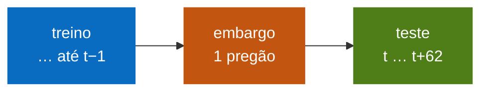
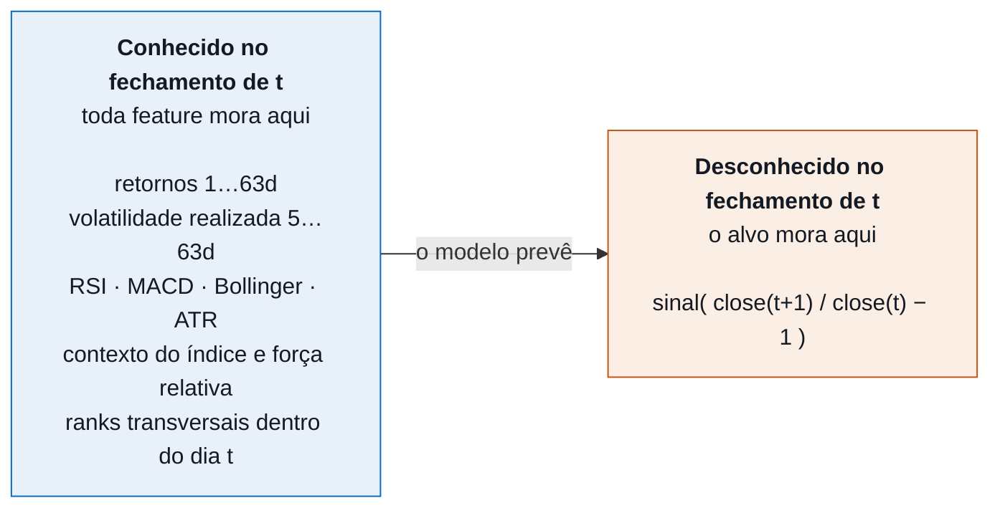
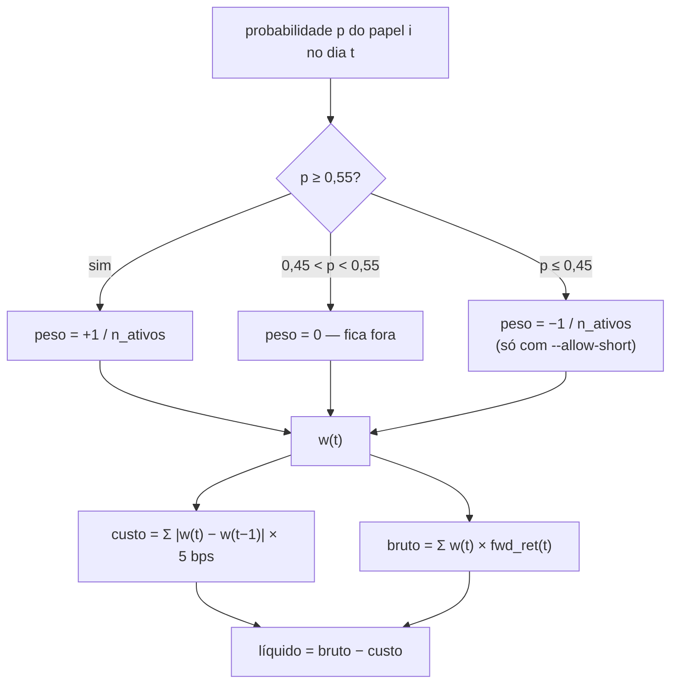

# market-direction

[English](README.md) · **Português**

Previsão direcional de ações (D+1) para a B3 e o S&P 500, construída em torno da
pergunta que a maioria dos projetos do gênero nunca faz: **o modelo realmente
prevê alguma coisa, ou o backtest está mentindo?**

O entregável não é uma acurácia bonita. É a infraestrutura de medição que permite
decidir se dá para acreditar na acurácia que aparece.

> **A manchete honesta:** na B3 existe um sinal real e minúsculo — 50,60% de
> acerto contra os 50% da moeda, p = 0,0079 em 40.169 previsões fora da amostra.
> Nos EUA não existe sinal direcional nenhum: a acurácia de 52,55% desaba para
> 49,94% de acurácia balanceada quando se desconta a tendência de alta do
> mercado. **Em nenhum dos dois mercados uma estratégia bateu comprar e segurar.**

📊 **[Dashboard interativo](https://claude.ai/code/artifact/bff3379c-289e-4078-94a0-a13d3a2776e4)** — candles por papel, chamadas do modelo dia a dia, PT/EN.

---

## O resultado, sem maquiagem

Tudo abaixo é **fora da amostra**, com walk-forward, custo de transação e embargo
entre treino e teste.

### B3 — 40.169 previsões, 2014-07 a 2026-08, 45 dobras

| modelo | acurácia | balanceada | AUC | p vs moeda | Sharpe líquido | exposição |
|---|---|---|---|---|---|---|
| sempre alta | 49,80% | 50,00% | 0,500 | 0,7877 | +0,74 | 100% |
| sinal de ontem | 49,04% | 49,03% | 0,490 | 0,9999 | −0,03 | 97% |
| aleatório | 50,41% | 50,41% | 0,505 | 0,0498 | +0,15 | 100% |
| **logística** | **50,60%** | **50,59%** | **0,510** | **0,0079** | +0,10 | 5% |
| LightGBM | 50,39% | 50,36% | 0,504 | 0,0598 | −0,15 | 6% |
| *comprar e segurar* | — | — | — | — | **+0,75** | 100% |

### S&P 500 — 47.805 previsões, 2013-12 a 2026-08, 51 dobras

| modelo | acurácia | balanceada | AUC | p vs moeda | Sharpe líquido | exposição |
|---|---|---|---|---|---|---|
| sempre alta | 52,77% | 50,00% | 0,500 | 0,0000 | +1,26 | 100% |
| sinal de ontem | 49,29% | 49,14% | 0,491 | 0,9990 | +0,21 | 97% |
| aleatório | 50,24% | 50,25% | 0,502 | 0,1528 | +0,33 | 100% |
| **logística** | 52,55% | **49,94%** | 0,503 | 0,0000 | +0,33 | 21% |
| LightGBM | 52,63% | 50,07% | 0,494 | 0,0000 | −0,03 | 18% |
| *comprar e segurar* | — | — | — | — | **+1,26** | 100% |

### Como ler isso

**Na B3 existe um sinal real, mas minúsculo.** A logística acerta 50,60% contra
50% da moeda, com p = 0,0079 em 40 mil previsões. É estatisticamente detectável e
economicamente irrelevante: uma vantagem de 0,6 ponto percentual não paga spread,
giro e imposto.

**Nos EUA não existe sinal direcional nenhum.** A acurácia de 52,6% impressiona
até você notar que 52,77% dos dias subiram. A acurácia balanceada — 49,94% — é o
número honesto: o modelo aprendeu que o mercado sobe, e nada além disso.

**Três dos cinco p-valores enganam, de propósito.** O `sempre alta` marca
p = 0,0000 nos EUA só porque pega carona na tendência, e o `aleatório` marca
p = 0,0498 na B3 porque, com cinco modelos testados, um cair abaixo de 0,05 por
acaso é exatamente o esperado. Essas linhas estão na tabela para o leitor ver
como é fácil fabricar um resultado "significante".

**Nenhuma estratégia bateu comprar e segurar.** Em nenhum dos dois mercados. Esse
é o resultado, e ele é o esperado por qualquer um que já mediu isso direito.

Se você viu um projeto parecido reportando 85% de acurácia, ele quase certamente
tem uma das três falhas abaixo — e este repositório existe, em boa parte, para
ser o contraexemplo.

---

## O pipeline



---

## As três armadilhas, e a defesa contra cada uma

### 1. Split aleatório em série temporal

Embaralhar as datas deixa o modelo treinar em segunda e quarta para prever terça.
A acurácia explode e não significa nada.

**Defesa:** walk-forward expansivo em
[`backtest.py`](src/marketdir/backtest.py). Treina em tudo até a data de corte,
testa no bloco seguinte de 63 pregões, avança. 45 dobras na B3, 51 nos EUA.
Nenhuma previsão avaliada foi vista pelo modelo que a produziu.



Entre treino e teste existe um **embargo de 1 dia**, porque o alvo da linha `t`
se realiza em `t+1` e encostaria no primeiro dia do bloco de teste:



### 2. Vazamento de futuro nas features

Um `shift` no lugar errado, uma janela móvel calculada ao contrário, um `fillna`
que propaga para trás — e o modelo enxerga amanhã.

A regra que o código impõe:



**Defesa:** [`scripts/check_leakage.py`](scripts/check_leakage.py), que não
argumenta — testa:

```bash
python scripts/check_leakage.py --market BR
```

- **Truncagem** — recalcula todas as features usando só o histórico até uma data
  D e compara com as mesmas features calculadas sobre o histórico completo
  naquele dia. Diferença medida: `0.000e+00`. Se alguma janela olhasse para
  frente, apareceria aqui.
- **Alinhamento do alvo** — confere na mão que `fwd_ret[t]` é o retorno entre `t`
  e `t+1`.
- **Alvo embaralhado** — treina com os rótulos permutados dentro de cada dia. Se
  a acurácia subir acima da classe majoritária, o vazamento veio por outro
  caminho.

A ressalva que nenhum teste cobre, dita em voz alta: os preços vêm ajustados por
proventos e desdobramentos (`auto_adjust`), e o ajuste de hoje reescreve o preço
de anos atrás. É uma pitada de informação futura que só sai com dado não ajustado
datado.

### 3. Backtest sem custo

Estratégia de giro alto morre no spread. Reportar retorno bruto é como reportar
salário sem imposto.

**Defesa:** o custo é cobrado sobre a **mudança** de peso, não sobre o peso —
manter posição aberta não paga corretagem de novo. Padrão de 5 bps por lado. O
relatório traz uma tabela dedicada de Sharpe bruto contra Sharpe líquido.



---

## Além disso: a probabilidade precisa valer o que diz

Um sistema que diz "62% de chance de alta" e acerta 52% das vezes está mentindo
com decimais. Por isso o projeto calibra — e escolhe o calibrador por medição:

```bash
python scripts/compare_calibration.py --market BR
```

| método | Brier | log loss | p máx | p mín | ECE |
|---|---|---|---|---|---|
| cru | 0,25065 | 0,69454 | 0,913 | 0,047 | 0,02551 |
| **Platt** | **0,25018** | **0,69352** | 0,640 | 0,314 | **0,01271** |
| isotônica | 0,25101 | 0,69826 | **0,999** | 0,001 | 0,01833 |

A isotônica emite "99,9% de chance de alta" apoiada em um punhado de observações
na cauda — flexível demais para um sinal deste tamanho. A sigmoide de dois
parâmetros de Platt não consegue mentir assim, e ganha em Brier e em ECE. Ela é o
padrão.

O calibrador é ajustado na **fatia final** do treino, nunca numa amostra
aleatória, e o corte é por data — o painel tem 15 papéis por dia e partir no meio
de um pregão deixaria o mesmo dia dos dois lados.

---

## Arquitetura

```
src/marketdir/
  config.py     universos, período, parâmetros do backtest e de custo
  data.py       ingestão yfinance com cache parquet (congela o dado do backtest)
  features.py   44 features, causais por construção
  labels.py     alvo D+1, close-to-close ou open-to-close
  models.py     baselines + logística + LightGBM + calibrador
  backtest.py   walk-forward e simulação de carteira com custo
  metrics.py    classificação, estratégia, teste binomial, bootstrap em blocos
  report.py     avaliação e geração de relatório
  figures.py    5 figuras, cada uma respondendo uma pergunta
scripts/
  fetch_data.py           baixa e cacheia os históricos
  check_leakage.py        auditoria de vazamento
  run_backtest.py         walk-forward completo + relatório + figuras
  compare_calibration.py  escolhe o calibrador por Brier/ECE
  predict_today.py        previsão para o próximo pregão
  export_history.py       candles recentes + a chamada do modelo em cada dia
  build_dashboard.py      gera o dashboard HTML autocontido
```

Documentação mais profunda:

| Documento | Português | English |
|---|---|---|
| Arquitetura e contratos de dados | [docs/pt-BR/architecture.md](docs/pt-BR/architecture.md) | [docs/en/architecture.md](docs/en/architecture.md) |
| Metodologia e estatística | [docs/pt-BR/methodology.md](docs/pt-BR/methodology.md) | [docs/en/methodology.md](docs/en/methodology.md) |

> Os comentários e docstrings do código estão em inglês; a documentação existe
> nos dois idiomas.

### Features (44)

Retornos defasados (1 a 63 dias), volatilidade realizada (5 a 63), momento
normalizado por volatilidade, momento 12-1, distância de médias móveis (20, 50,
200), RSI, MACD, Bollinger %B, ATR, amplitude, gap de abertura, posição do
fechamento dentro da barra, razão de volume, drawdown de 252 dias, assimetria,
contexto do índice (Ibovespa ou S&P 500), força relativa contra o índice, ranks
transversais dentro do dia e calendário.

Duas escolhas que importam:

- **Painel agrupado, não um modelo por papel.** 15 papéis × 15 anos dá dado
  suficiente para o modelo aprender padrão de mercado em vez de decorar o
  histórico de uma empresa.
- **Ranks transversais.** Torna papéis de escalas diferentes comparáveis dentro
  do mesmo dia, sem o modelo precisar reaprender a escala de cada um.

### Hiperparâmetros do LightGBM

Conservadores de propósito: `num_leaves=15`, `min_child_samples=200`,
`reg_lambda=10`, `learning_rate=0.02`. Em dado financeiro a razão sinal/ruído é
baixa; árvore profunda decora ruído e o backtest parece ótimo até o momento em
que não parece. Ainda assim, **a logística ganha do boosting nos dois mercados** —
resultado conhecido em previsão direcional e reproduzido aqui.

---

## Como rodar

```bash
python -m venv .venv
.venv/Scripts/activate          # Linux/macOS: source .venv/bin/activate
pip install -r requirements.txt
```

```bash
python scripts/fetch_data.py --markets BR US
python scripts/check_leakage.py --market BR
python scripts/run_backtest.py --market BR
python scripts/run_backtest.py --market US
python scripts/predict_today.py
python scripts/export_history.py
python scripts/build_dashboard.py
```

O backtest completo de um mercado leva cerca de 45 segundos.

Parâmetros úteis do `run_backtest.py`:

| flag | padrão | efeito |
|---|---|---|
| `--threshold` | 0.55 | probabilidade mínima para abrir posição |
| `--cost-bps` | 5.0 | custo por lado, em basis points |
| `--target-mode` | close_to_close | ou `open_to_close`, totalmente executável |
| `--test-block-days` | 63 | tamanho do bloco de teste (≈ 1 trimestre) |
| `--allow-short` | desligado | permite posição vendida |

---

## Limitações conhecidas

- **Preços ajustados retroativamente** (`auto_adjust`) carregam um resquício de
  informação futura. Some só com dado não ajustado datado, que o yfinance não dá.
- **Sem tratamento de sobrevivência**: o universo é fixo e composto por papéis que
  existem hoje. Empresas que quebraram no caminho não estão no teste, o que
  empurra os retornos para cima — inclusive os do comprar e segurar.
- **Custo é estimativa**: 5 bps por lado é razoável para papel líquido, otimista
  para papel fino. Sem impacto de mercado modelado.
- **Sem imposto**: 15% sobre ganho em swing trade na B3, 20% em day trade. Nenhum
  dos dois está no cálculo.
- **`close_to_close` assume execução no leilão de fechamento.** Use
  `--target-mode open_to_close` para a versão sem essa hipótese, ao custo de
  descartar o retorno overnight.

## Próximos passos naturais

- **Seleção top-N em vez de limiar fixo.** A probabilidade crua ordena melhor que
  a calibrada; comprar os N papéis mais bem ranqueados do dia usa o sinal fraco
  melhor do que um corte absoluto.
- **Prever magnitude, não só direção.** Direção joga fora a informação de que um
  movimento de 3% e um de 0,1% não valem o mesmo.
- **Horizonte de 5 dias.** Menos ruído por previsão e menos giro para pagar.
- **Regime de volatilidade como filtro**, em vez de feature: o sinal pode existir
  só em parte dos regimes e ser diluído pela média.

---

## Aviso

Projeto de estudo e portfólio. Os números acima descrevem um sistema que **não
bate comprar e segurar**. Nada aqui é recomendação de investimento.
