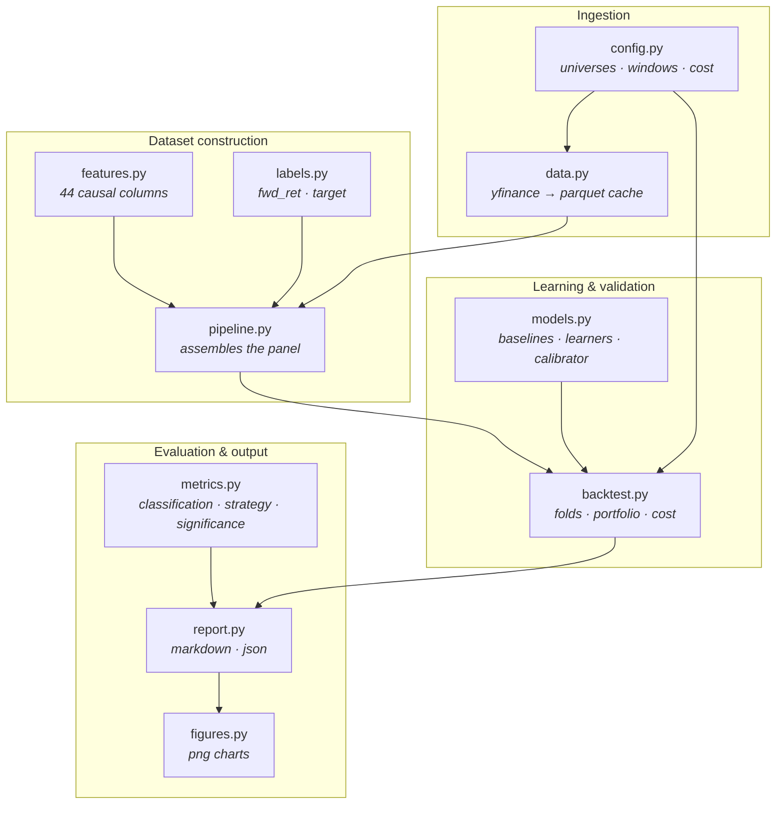
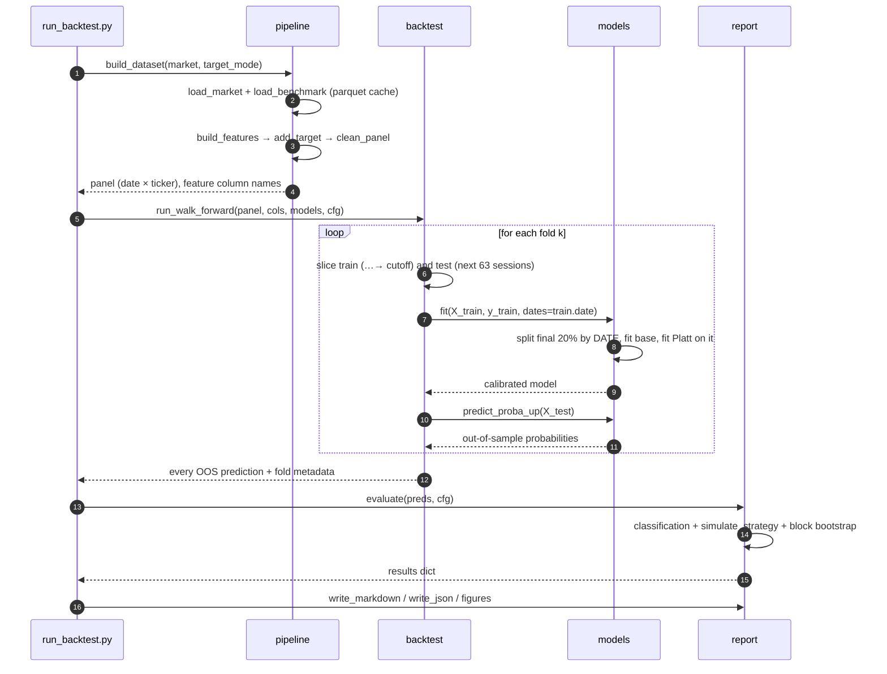
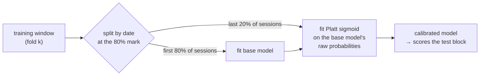

# Architecture

[English](../en/architecture.md) · [Português](../pt-BR/architecture.md) · [← README](../../README.md)

How the pieces fit, what each one promises the next, and where to plug in new
work.

---

## Module map

Every arrow is a one-way dependency. Nothing imports upward, so any module can be
tested against synthetic input without dragging the network in.

`config.py` is the only module everything else may read from. If a number changes
behaviour, it lives there — so a published result is reproducible from one file.

---

## The run, end to end

---

## Data contracts

Each stage hands the next a frame with a fixed shape. Breaking one of these is
the fastest way to produce silently wrong numbers, so they are worth stating.

### `data.load_market(market)` → long panel

| column | type | meaning |
|---|---|---|
| `date` | datetime64, tz-naive | session date |
| `ticker` | str | Yahoo symbol (`PETR4.SA`, `AAPL`) |
| `open`,`high`,`low`,`close` | float | adjusted prices (`auto_adjust=True`) |
| `volume` | float | traded volume |

One row per (date, ticker). Sorted by ticker, then date. Rows with `close <= 0`
are dropped; duplicated dates keep the last observation.

### `features.build_features(panel, benchmark)` → feature matrix

Adds 44 columns, plus `date`, `ticker`, `close` and `open` carried through for
downstream use. **Every feature column is a function of data timestamped `<= t`.**
`feature_columns(df)` returns exactly the modelling columns, excluding the
carried-through and label columns listed in `NON_FEATURE_COLS`.

### `labels.add_target(df, mode)` → adds the label

| column | meaning |
|---|---|
| `fwd_ret` | simple return of the trade, from t to t+1 |
| `target` | `1` if `fwd_ret > 0`, else `0`; `NaN` on the last row of each ticker |

This is the only module allowed to call `shift(-1)`.

### `backtest.run_walk_forward(...)` → out-of-sample predictions

| column | meaning |
|---|---|
| `date`, `ticker` | identify the prediction |
| `target`, `fwd_ret` | the realized outcome |
| `fold` | which test block it came from |
| `prob__<model>` | one column per model, probability of an up day |

`df.attrs["feature_importance"]` carries the mean LightGBM importance across
folds. Note that `attrs` does not survive `to_parquet`, which is why
`run_backtest.py` writes importance to its own CSV.

---

## Where the calibration split happens

The subtlety that is easy to get wrong: the calibrator must be fitted on data the
base model has not seen, and the split must be by **date**, not by row — the panel
holds 15 tickers per session, so a row-wise split leaves the same trading day on
both sides.

If the calibration slice would hold fewer than 500 rows, or if it contains a
single class, `CalibratedModel` falls back to fitting the base model on the whole
window and skips calibration rather than fitting a meaningless sigmoid.

---

## Output artifacts

| path | produced by | content |
|---|---|---|
| `data/raw/*.parquet` | `fetch_data.py` | per-ticker OHLCV cache |
| `data/processed/oos_predictions_<market>.parquet` | `run_backtest.py` | every out-of-sample prediction |
| `data/processed/feature_importance_<market>.csv` | `run_backtest.py` | mean LightGBM importance |
| `reports/backtest_<market>.md` | `run_backtest.py` | human-readable report |
| `reports/backtest_<market>.json` | `run_backtest.py` | machine-readable metrics + equity curves |
| `reports/figures/*.png` | `figures.py` | 5 charts per market |
| `reports/latest_predictions.json` | `predict_today.py` | next-session probabilities |
| `reports/recent_history.json` | `export_history.py` | recent candles + the model's call each day |
| `reports/dashboard.html` | `build_dashboard.py` | self-contained dashboard, PT/EN |

Everything under `data/` and `reports/` is generated and git-ignored: a clean
clone reproduces all of it from the scripts.

---

## Extension points

**A new model.** Subclass `BaseModel`, implement `fit(X, y, dates=None)` and
`predict_proba_up(X)`, add it to `default_models()`. It automatically inherits
walk-forward validation, Platt calibration, the cost-aware portfolio simulation
and every report row. Set `calibrate = False` if the model's output should not be
recalibrated (that is what the trivial baselines do).

**A new feature.** Add it inside `_per_ticker_features` (per-ticker series) or in
`build_features` (market context and cross-sectional). Then run
`scripts/check_leakage.py`: the truncation test will catch a window that peeks
forward. No registration step — `feature_columns` discovers columns by exclusion.

**A new market.** Add the universe and its benchmark to `config.py`. Nothing else
changes; the calendar is derived from the data.

**A different position rule.** `simulate_strategy` is the single place that turns
probabilities into weights. Top-N selection, volatility targeting or a regime
filter all belong there, and every metric downstream picks them up for free.
