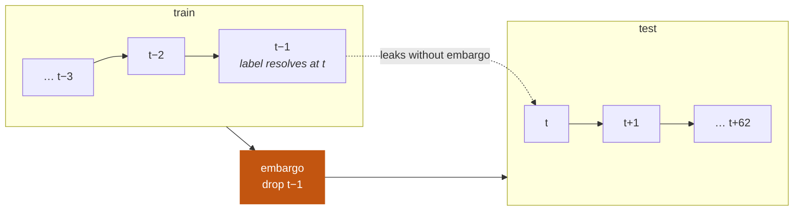

# Methodology

[English](../en/methodology.md) · [Português](../pt-BR/methodology.md) · [← README](../../README.md)

Why the numbers in this repository are believable, stated as procedures rather
than claims. Each section names the failure mode it defends against.

---

## 1. What is being predicted

For every ticker *i* and session *t*, the label is the direction of the next
session:

$$
y_{i,t} = \mathbf{1}\left[\frac{C_{i,t+1}}{C_{i,t}} - 1 > 0\right]
$$

The model sees only information available at the close of *t* and outputs
$\hat{p}_{i,t} = P(y_{i,t} = 1)$.

Two execution assumptions are available:

| mode | decision | entry | exit | assumption |
|---|---|---|---|---|
| `close_to_close` (default) | close of *t* | close of *t* | close of *t+1* | you can trade the closing auction |
| `open_to_close` | close of *t* | open of *t+1* | close of *t+1* | none, but discards the overnight move |

The default is the one comparable to the published literature. The alternative
exists because "assume you can execute at the close you used to decide" is a real
assumption, and a reader is entitled to see the result without it.

---

## 2. Validation: expanding walk-forward

**Failure mode it defends against:** a random train/test split on a time series
lets the model train on Monday and Wednesday to predict Tuesday. Accuracy
explodes and means nothing.

The window expands rather than slides: every fold trains on all history up to its
cutoff. This matches how the system would actually be operated — you never throw
away data you already have.

| parameter | value | why |
|---|---|---|
| `min_train_days` | 750 | ≈ 3 years before the first prediction |
| `test_block_days` | 63 | ≈ 1 quarter, so folds are readable as time periods |
| `embargo_days` | 1 | see below |

45 folds on B3, 51 on the S&P 500. Every evaluated prediction was produced by a
model that never saw that day.

### The embargo

The target of row *t* resolves at *t+1*. Without an embargo, the last training
row's outcome is the first test day — the model would be trained on a label that
belongs to the evaluation period.



One day is enough because the horizon is one day. A five-day horizon would need a
five-day embargo.

---

## 3. Feature causality

**Failure mode:** one misplaced `shift`, one rolling window computed over the
wrong slice, one `fillna` that back-propagates — and the model reads tomorrow's
price.

The rule enforced in `features.py`: every column produced for row (*t*, *i*)
depends only on data timestamped ≤ *t*. Cross-sectional ranks are computed within
day *t*, which is legal — the whole day's closes are known at the close.

The defense is not a code review. It is `scripts/check_leakage.py`:

**Truncation test.** Recompute every feature using only history up to date *D*,
then compare against the same features computed over the full history on that
same day. Any window that reaches forward produces a non-zero difference.

```
[OK ] cutoff 2018-05-04  largest difference = 0.000e+00
[OK ] cutoff 2021-09-09  largest difference = 0.000e+00
[OK ] cutoff 2025-01-06  largest difference = 0.000e+00
```

**Target alignment.** Verifies element by element that `fwd_ret[t]` equals
`close[t+1] / close[t] - 1` for randomly sampled tickers.

**Shuffled target.** Permutes labels within each day — destroying any real
relationship with the features while preserving each session's up rate — and
re-runs the walk-forward. Accuracy must collapse to the majority class. If it
does not, leakage entered through some path the first two tests do not cover.

### The caveat no test covers

Prices come dividend- and split-adjusted (`auto_adjust=True`). Today's adjustment
factor rewrites prices from years ago, so the historical series carries a trace of
information that was not available at the time. The effect on daily direction is
small, but it is real, and it only disappears with point-in-time unadjusted data
that yfinance does not provide. This is stated rather than hidden.

---

## 4. Calibration

**Failure mode:** a model that says "62% chance of an up day" and is right 52% of
the time is lying with decimal places. Since the system's useful output is a
probability, not a hard up/down call, that probability has to mean something.

Calibration is fitted on the **final 20% of the training window**, split by date,
never on a random sample — mixing dates would leak the future into the fit, and a
row-wise split would leave the same session on both sides of the split.

The method was chosen by measurement, not preference
(`scripts/compare_calibration.py`, B3, 40,169 out-of-sample predictions):

| method | Brier ↓ | log loss ↓ | p max | p min | ECE ↓ |
|---|---|---|---|---|---|
| raw | 0.25065 | 0.69454 | 0.913 | 0.047 | 0.02551 |
| **Platt (sigmoid)** | **0.25018** | **0.69352** | 0.640 | 0.314 | **0.01271** |
| isotonic | 0.25101 | 0.69826 | **0.999** | 0.001 | 0.01833 |

Isotonic regression is more flexible, and with a signal this weak that flexibility
is a liability: it fits step functions on handfuls of tail observations and emits
`0.999` from half a dozen points. Platt's two-parameter sigmoid cannot do that,
and it wins on both Brier and ECE. It is the default.

> **A note on the AUC column in the reports.** AUC is invariant to monotone
> transformations *within a fold*, but the reports pool all folds, and each fold
> calibrates with its own parameters. That reorders predictions across folds, so
> the pooled AUC shifts even when the base model is identical. Per-fold AUC is
> the quantity to compare if you want strict invariance.

---

## 5. Transaction cost

**Failure mode:** high-turnover strategies die in the spread. Reporting gross
returns is reporting salary before tax.

Cost is charged on the **change** in weight, not on the weight:

$$
\text{cost}_t = c \sum_i \left| w_{i,t} - w_{i,t-1} \right|, \qquad c = 5\ \text{bps}
$$

Holding a position open does not pay commission again. That distinction is what
decides whether a strategy survives, and getting it wrong in either direction
produces a wrong answer: charge on the weight and you punish patient strategies;
charge nothing and you reward churn.

The default of 5 bps per side (10 bps round trip) covers spread plus slippage plus
commission — reasonable for a liquid name, optimistic for a thin one. No market
impact is modelled. The report always shows gross Sharpe next to net Sharpe so the
size of the drag is visible rather than buried.

---

## 6. Significance

**Failure mode:** reporting 50.6% accuracy as if it obviously beat 50%, without
asking whether the difference fits inside the noise.

**Binomial test.** For *n* predictions with *k* correct, report
$P(X \geq k)$ under $X \sim \text{Binomial}(n, 0.5)$. On B3 the logistic model
gets p = 0.0079 — a real edge. LightGBM gets p = 0.0598 — not distinguishable
from chance at the conventional threshold.

**Block bootstrap for the Sharpe ratio.** Resampling individual days would ignore
the autocorrelation of returns and produce a confidence interval that is far too
narrow. Blocks of 21 days preserve it. If the interval crosses zero, the strategy
has proved nothing:

```
logistic  net Sharpe +0.10, 95% CI [−0.32, +0.49]   ← crosses zero
buy & hold net Sharpe +0.75, 95% CI [+0.13, +1.44]
```

**Multiple-comparison honesty.** Five models are tested per market. With five
tests at α = 0.05, one false positive is the expected outcome — and in fact
`random` scores p = 0.0498 on B3. That row is left in the report on purpose: it
shows the reader exactly how a "significant" result gets manufactured.

---

## 7. Baselines

**Failure mode:** 53% accuracy sounds like skill until you learn 53% of days were
up. Without a baseline there is no way to tell signal from drift.

| baseline | what it isolates |
|---|---|
| `always_up` | the market's upward drift; its strategy *is* buy and hold paying cost |
| `prev_sign` | naive momentum — does yesterday's direction carry? |
| `random` | the noise floor, and a demonstration of multiple-testing risk |
| buy and hold | the economic competitor any strategy must beat to justify existing |

`always_up` doubles as a sanity check on the simulator: it produced Sharpe +0.74
against buy and hold's +0.75 on B3, the gap being exactly the transaction cost of
the initial position. A simulator that failed to reproduce that would be broken.

Reporting **balanced accuracy** alongside raw accuracy is what exposes the US
result: 52.55% raw looks like an edge, 49.94% balanced says the model learned the
drift and nothing more.

---

## 8. What would change the conclusion

The result — a small, statistically real, economically useless edge in Brazil and
none in the US — is what the design was built to be able to detect honestly. Things
that could legitimately move it:

- **Top-N selection instead of a fixed threshold.** Raw probabilities rank better
  than calibrated ones; picking the N best-ranked tickers each day uses a weak
  signal more efficiently than an absolute cutoff.
- **Magnitude, not just direction.** A 3% move and a 0.1% move are not worth the
  same, and the current label throws that away.
- **A longer horizon.** Five days means less noise per prediction and less
  turnover to pay for.
- **Regime conditioning.** The signal may exist only in certain volatility
  regimes and be diluted by averaging across all of them.

Things that would *not* legitimately move it: dropping the embargo, using a random
split, removing transaction cost, or tuning the threshold on the test set. Each of
those would raise the reported numbers and lower how much they are worth.
