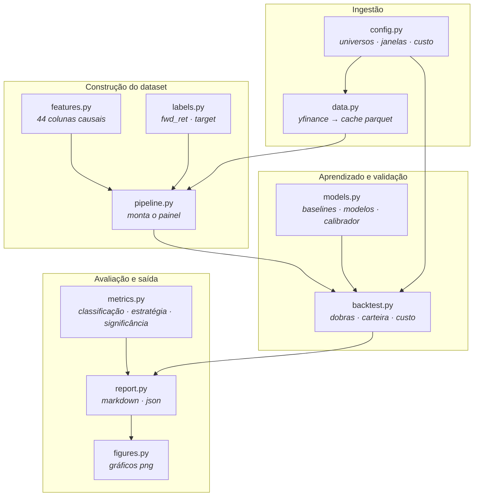
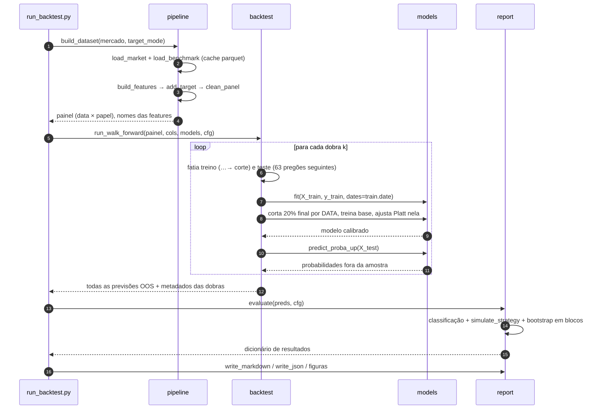
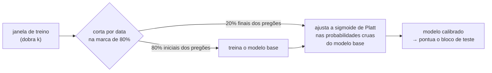

# Arquitetura

[Português](../pt-BR/architecture.md) · [English](../en/architecture.md) · [← README](../../README.pt-BR.md)

Como as peças se encaixam, o que cada uma promete à seguinte, e onde plugar
trabalho novo.

---

## Mapa dos módulos

Toda seta é uma dependência de mão única. Nada importa para cima, então qualquer
módulo pode ser testado com entrada sintética sem arrastar a rede junto.

`config.py` é o único módulo que todos os outros podem ler. Se um número muda
comportamento, ele mora lá — assim um resultado publicado é reproduzível a partir
de um arquivo só.

---

## A execução, ponta a ponta

---

## Contratos de dados

Cada etapa entrega à seguinte um frame de formato fixo. Quebrar um destes é o
jeito mais rápido de produzir números silenciosamente errados, então vale
enunciá-los.

### `data.load_market(mercado)` → painel long

| coluna | tipo | significado |
|---|---|---|
| `date` | datetime64, sem timezone | data do pregão |
| `ticker` | str | símbolo Yahoo (`PETR4.SA`, `AAPL`) |
| `open`,`high`,`low`,`close` | float | preços ajustados (`auto_adjust=True`) |
| `volume` | float | volume negociado |

Uma linha por (data, papel). Ordenado por papel e depois por data. Linhas com
`close <= 0` são descartadas; datas duplicadas mantêm a última observação.

### `features.build_features(panel, benchmark)` → matriz de features

Adiciona 44 colunas, mais `date`, `ticker`, `close` e `open` carregados adiante
para uso posterior. **Toda coluna de feature é função de dados com timestamp
`<= t`.** `feature_columns(df)` devolve exatamente as colunas de modelagem,
excluindo as carregadas e as de rótulo listadas em `NON_FEATURE_COLS`.

### `labels.add_target(df, mode)` → adiciona o rótulo

| coluna | significado |
|---|---|
| `fwd_ret` | retorno simples do trade, de t para t+1 |
| `target` | `1` se `fwd_ret > 0`, senão `0`; `NaN` na última linha de cada papel |

Este é o único módulo autorizado a chamar `shift(-1)`.

### `backtest.run_walk_forward(...)` → previsões fora da amostra

| coluna | significado |
|---|---|
| `date`, `ticker` | identificam a previsão |
| `target`, `fwd_ret` | o resultado realizado |
| `fold` | de qual bloco de teste veio |
| `prob__<modelo>` | uma coluna por modelo, probabilidade de alta |

`df.attrs["feature_importance"]` carrega a importância média do LightGBM entre as
dobras. `attrs` não sobrevive ao `to_parquet`, e é por isso que
`run_backtest.py` grava a importância num CSV próprio.

---

## Onde acontece o corte de calibração

A sutileza fácil de errar: o calibrador precisa ser ajustado em dado que o modelo
base não viu, e o corte tem de ser por **data**, não por linha — o painel tem 15
papéis por pregão, então um corte por linha deixaria o mesmo dia dos dois lados.

Se a fatia de calibração ficaria com menos de 500 linhas, ou se ela contém uma
única classe, o `CalibratedModel` volta a treinar o modelo base na janela inteira
e pula a calibração, em vez de ajustar uma sigmoide sem sentido.

---

## Artefatos de saída

| caminho | produzido por | conteúdo |
|---|---|---|
| `data/raw/*.parquet` | `fetch_data.py` | cache de OHLCV por papel |
| `data/processed/oos_predictions_<mercado>.parquet` | `run_backtest.py` | todas as previsões fora da amostra |
| `data/processed/feature_importance_<mercado>.csv` | `run_backtest.py` | importância média do LightGBM |
| `reports/backtest_<mercado>.md` | `run_backtest.py` | relatório legível |
| `reports/backtest_<mercado>.json` | `run_backtest.py` | métricas + curvas de capital, legível por máquina |
| `reports/figures/*.png` | `figures.py` | 5 gráficos por mercado |
| `reports/latest_predictions.json` | `predict_today.py` | probabilidades do próximo pregão |
| `reports/recent_history.json` | `export_history.py` | candles recentes + a chamada do modelo em cada dia |
| `reports/dashboard.html` | `build_dashboard.py` | dashboard autocontido, PT/EN |

Tudo em `data/` e `reports/` é gerado e está no `.gitignore`: um clone limpo
reproduz tudo a partir dos scripts.

---

## Pontos de extensão

**Um modelo novo.** Herde de `BaseModel`, implemente `fit(X, y, dates=None)` e
`predict_proba_up(X)`, e adicione em `default_models()`. Ele herda
automaticamente a validação walk-forward, a calibração de Platt, a simulação de
carteira com custo e todas as linhas do relatório. Use `calibrate = False` se a
saída do modelo não deve ser recalibrada (é o que os baselines triviais fazem).

**Uma feature nova.** Adicione dentro de `_per_ticker_features` (série por papel)
ou em `build_features` (contexto de mercado e corte transversal). Depois rode
`scripts/check_leakage.py`: o teste de truncagem pega uma janela que espia o
futuro. Não há passo de registro — `feature_columns` descobre as colunas por
exclusão.

**Um mercado novo.** Adicione o universo e o benchmark em `config.py`. Nada mais
muda; o calendário é derivado do próprio dado.

**Outra regra de posição.** `simulate_strategy` é o único lugar que transforma
probabilidade em peso. Seleção top-N, alvo de volatilidade ou filtro de regime
pertencem todos ali, e toda métrica a jusante os incorpora de graça.
