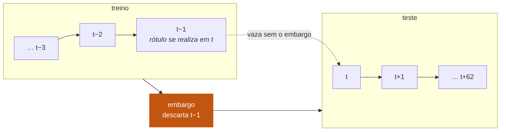

# Metodologia

[Português](../pt-BR/methodology.md) · [English](../en/methodology.md) · [← README](../../README.pt-BR.md)

Por que os números deste repositório são críveis, enunciado como procedimento em
vez de afirmação. Cada seção nomeia o modo de falha contra o qual se defende.

---

## 1. O que está sendo previsto

Para cada papel *i* e pregão *t*, o rótulo é a direção do pregão seguinte:

$$
y_{i,t} = \mathbf{1}\left[\frac{C_{i,t+1}}{C_{i,t}} - 1 > 0\right]
$$

O modelo vê apenas informação disponível no fechamento de *t* e devolve
$\hat{p}_{i,t} = P(y_{i,t} = 1)$.

Duas hipóteses de execução estão disponíveis:

| modo | decide | entra | sai | hipótese |
|---|---|---|---|---|
| `close_to_close` (padrão) | fechamento de *t* | fechamento de *t* | fechamento de *t+1* | dá para operar no leilão de fechamento |
| `open_to_close` | fechamento de *t* | abertura de *t+1* | fechamento de *t+1* | nenhuma, mas descarta o movimento overnight |

O padrão é o comparável com a literatura publicada. A alternativa existe porque
"suponha que dá para executar no mesmo fechamento que você usou para decidir" é
uma hipótese de verdade, e o leitor tem direito de ver o resultado sem ela.

---

## 2. Validação: walk-forward expansivo

**Modo de falha que ele evita:** um split aleatório em série temporal deixa o
modelo treinar em segunda e quarta para prever terça. A acurácia explode e não
significa nada.

A janela expande em vez de deslizar: cada dobra treina em todo o histórico até o
seu corte. Isso espelha como o sistema seria operado de fato — você nunca joga
fora dado que já tem.

| parâmetro | valor | motivo |
|---|---|---|
| `min_train_days` | 750 | ≈ 3 anos antes da primeira previsão |
| `test_block_days` | 63 | ≈ 1 trimestre, para as dobras serem legíveis como períodos |
| `embargo_days` | 1 | ver abaixo |

45 dobras na B3, 51 no S&P 500. Toda previsão avaliada foi produzida por um
modelo que nunca viu aquele dia.

### O embargo

O alvo da linha *t* se realiza em *t+1*. Sem embargo, o resultado da última linha
de treino é o primeiro dia de teste — o modelo seria treinado com um rótulo que
pertence ao período de avaliação.



Um dia basta porque o horizonte é de um dia. Um horizonte de cinco dias exigiria
um embargo de cinco dias.

---

## 3. Causalidade das features

**Modo de falha:** um `shift` fora de lugar, uma janela móvel calculada sobre a
fatia errada, um `fillna` que propaga para trás — e o modelo lê o preço de amanhã.

A regra imposta em `features.py`: toda coluna produzida para a linha (*t*, *i*)
depende apenas de dados com timestamp ≤ *t*. Os ranks transversais são calculados
dentro do dia *t*, o que é legítimo — todos os fechamentos do dia são conhecidos
no fechamento.

A defesa não é revisão de código. É o `scripts/check_leakage.py`:

**Teste de truncagem.** Recalcula todas as features usando só o histórico até a
data *D* e compara com as mesmas features calculadas sobre o histórico completo
naquele dia. Qualquer janela que alcance o futuro produz diferença diferente de
zero.

```
[OK ] corte 2018-05-04  maior diferença = 0.000e+00
[OK ] corte 2021-09-09  maior diferença = 0.000e+00
[OK ] corte 2025-01-06  maior diferença = 0.000e+00
```

**Alinhamento do alvo.** Verifica elemento a elemento que `fwd_ret[t]` é igual a
`close[t+1] / close[t] - 1` para papéis sorteados.

**Alvo embaralhado.** Permuta os rótulos dentro de cada dia — destruindo qualquer
relação real com as features e preservando a taxa de alta de cada pregão — e roda
o walk-forward de novo. A acurácia tem que desabar para a classe majoritária. Se
não desabar, o vazamento entrou por algum caminho que os dois primeiros testes não
cobrem.

### A ressalva que nenhum teste cobre

Os preços vêm ajustados por proventos e desdobramentos (`auto_adjust=True`). O
fator de ajuste de hoje reescreve preços de anos atrás, então a série histórica
carrega um resquício de informação que não estava disponível na época. O efeito na
direção diária é pequeno, mas é real, e só some com dado não ajustado datado, que
o yfinance não fornece. Isso está declarado, não escondido.

---

## 4. Calibração

**Modo de falha:** um modelo que diz "62% de chance de alta" e acerta 52% das
vezes está mentindo com decimais. Como a saída útil do sistema é uma
probabilidade, e não uma chamada dura de sobe/desce, essa probabilidade precisa
significar alguma coisa.

A calibração é ajustada nos **20% finais da janela de treino**, cortados por data,
nunca em amostra aleatória — misturar datas vazaria o futuro para dentro do ajuste,
e um corte por linha deixaria o mesmo pregão dos dois lados.

O método foi escolhido por medição, não por preferência
(`scripts/compare_calibration.py`, B3, 40.169 previsões fora da amostra):

| método | Brier ↓ | log loss ↓ | p máx | p mín | ECE ↓ |
|---|---|---|---|---|---|
| cru | 0,25065 | 0,69454 | 0,913 | 0,047 | 0,02551 |
| **Platt (sigmoide)** | **0,25018** | **0,69352** | 0,640 | 0,314 | **0,01271** |
| isotônica | 0,25101 | 0,69826 | **0,999** | 0,001 | 0,01833 |

A isotônica é mais flexível, e com sinal deste tamanho essa flexibilidade é
defeito: ela ajusta funções degrau em cima de punhados de observações da cauda e
cospe `0,999` a partir de meia dúzia de pontos. A sigmoide de dois parâmetros de
Platt não consegue fazer isso, e vence em Brier e em ECE. É o padrão.

> **Nota sobre a coluna AUC nos relatórios.** A AUC é invariante a transformação
> monótona *dentro de uma dobra*, mas os relatórios agregam todas as dobras, e
> cada uma calibra com parâmetros próprios. Isso reordena previsões entre dobras,
> então a AUC agregada muda mesmo com o modelo base idêntico. A AUC por dobra é a
> quantidade a comparar se você quer invariância estrita.

---

## 5. Custo de transação

**Modo de falha:** estratégia de giro alto morre no spread. Reportar retorno bruto
é reportar salário sem imposto.

O custo é cobrado sobre a **mudança** de peso, não sobre o peso:

$$
\text{custo}_t = c \sum_i \left| w_{i,t} - w_{i,t-1} \right|, \qquad c = 5\ \text{bps}
$$

Manter posição aberta não paga corretagem de novo. Essa distinção é o que decide
se uma estratégia sobrevive, e errá-la em qualquer direção produz resposta errada:
cobrar sobre o peso pune estratégias pacientes; não cobrar nada premia o churn.

O padrão de 5 bps por lado (10 bps no giro completo) cobre spread mais slippage
mais corretagem — razoável para papel líquido, otimista para papel fino. Sem
impacto de mercado modelado. O relatório sempre mostra o Sharpe bruto ao lado do
líquido, para o tamanho da perda ficar visível em vez de enterrado.

---

## 6. Significância

**Modo de falha:** reportar 50,6% de acurácia como se obviamente batesse 50%, sem
perguntar se a diferença cabe dentro do ruído.

**Teste binomial.** Para *n* previsões com *k* acertos, reporta
$P(X \geq k)$ sob $X \sim \text{Binomial}(n, 0{,}5)$. Na B3 a logística tira
p = 0,0079 — vantagem real. O LightGBM tira p = 0,0598 — indistinguível do acaso
no limiar convencional.

**Bootstrap em blocos para o Sharpe.** Reamostrar dias individuais ignoraria a
autocorrelação dos retornos e produziria um intervalo de confiança estreito demais.
Blocos de 21 dias preservam a autocorrelação. Se o intervalo cruza zero, a
estratégia não provou nada:

```
logística        Sharpe líquido +0,10, IC 95% [−0,32, +0,49]   ← cruza zero
comprar e segurar Sharpe        +0,75, IC 95% [+0,13, +1,44]
```

**Honestidade sobre comparações múltiplas.** Cinco modelos são testados por
mercado. Com cinco testes a α = 0,05, um falso positivo é o resultado esperado — e
de fato o `aleatório` marca p = 0,0498 na B3. Essa linha fica no relatório de
propósito: mostra ao leitor exatamente como um resultado "significante" é
fabricado.

---

## 7. Baselines

**Modo de falha:** 53% de acurácia parece habilidade até você descobrir que 53%
dos dias subiram. Sem baseline não dá para separar sinal de tendência.

| baseline | o que ele isola |
|---|---|
| `sempre alta` | a tendência de alta do mercado; a estratégia dele *é* comprar e segurar pagando custo |
| `sinal de ontem` | momento ingênuo — a direção de ontem carrega alguma coisa? |
| `aleatório` | o piso de ruído, e uma demonstração do risco de teste múltiplo |
| comprar e segurar | o concorrente econômico que qualquer estratégia precisa bater para existir |

O `sempre alta` funciona também como teste de sanidade do simulador: ele produziu
Sharpe +0,74 contra +0,75 do comprar e segurar na B3, e a diferença é exatamente o
custo de transação da posição inicial. Um simulador que não reproduzisse isso
estaria quebrado.

Reportar **acurácia balanceada** ao lado da acurácia crua é o que expõe o
resultado dos EUA: 52,55% cru parece vantagem, 49,94% balanceado diz que o modelo
aprendeu a tendência e nada mais.

---

## 8. O que mudaria a conclusão

O resultado — uma vantagem pequena, estatisticamente real e economicamente inútil
no Brasil, e nenhuma nos EUA — é o que o desenho foi construído para conseguir
detectar honestamente. Coisas que poderiam legitimamente mexer nele:

- **Seleção top-N em vez de limiar fixo.** A probabilidade crua ordena melhor que
  a calibrada; escolher os N papéis mais bem ranqueados de cada dia usa um sinal
  fraco de forma mais eficiente do que um corte absoluto.
- **Magnitude, não só direção.** Um movimento de 3% e um de 0,1% não valem o
  mesmo, e o rótulo atual joga isso fora.
- **Horizonte mais longo.** Cinco dias significa menos ruído por previsão e menos
  giro para pagar.
- **Condicionamento por regime.** O sinal pode existir só em certos regimes de
  volatilidade e ser diluído pela média entre todos eles.

Coisas que *não* mexeriam nele legitimamente: tirar o embargo, usar split
aleatório, remover o custo de transação, ou calibrar o limiar no conjunto de
teste. Cada uma dessas elevaria os números reportados e reduziria o quanto eles
valem.
